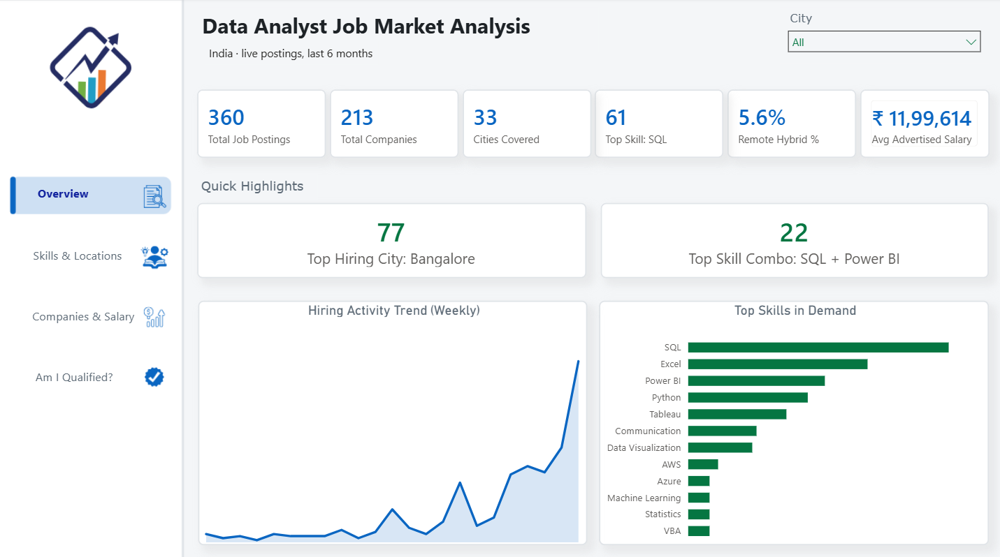
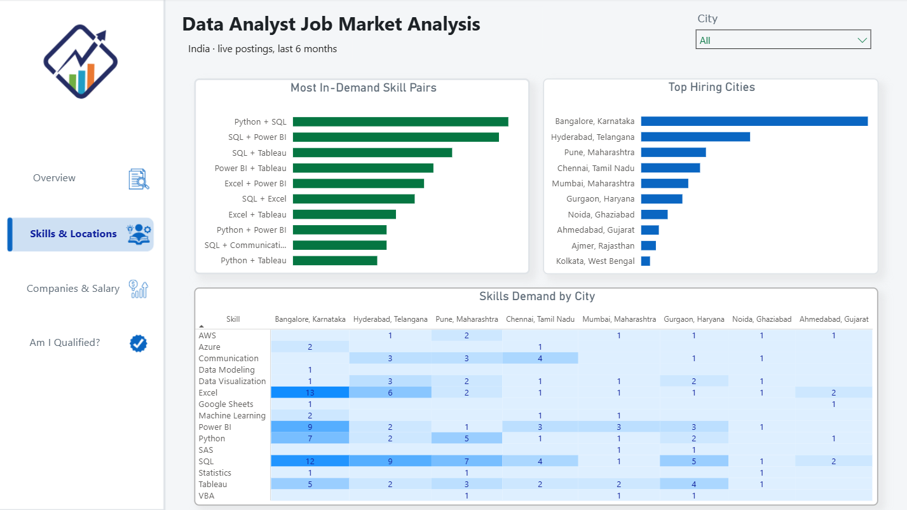
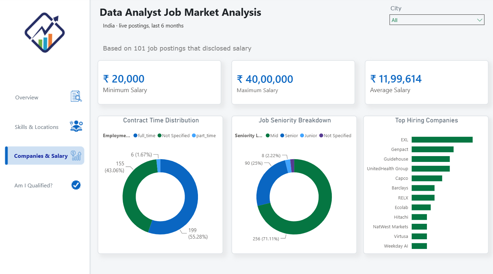
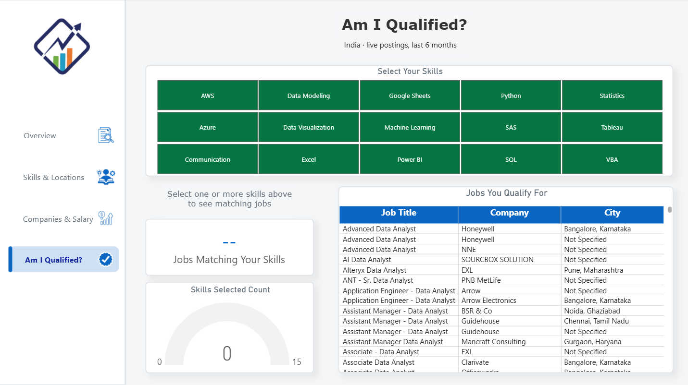

# Data Analyst Job Market Analysis (India)

An end-to-end data analytics project analyzing the current Data Analyst job market in India — from live API data collection to a fully interactive 4-page Power BI dashboard.

## Project Overview

This project pulls real-time job posting data via the Adzuna API, cleans and analyzes it in Python, and visualizes it in an interactive Power BI report. It covers skills in demand, hiring locations, top companies, salary ranges, and includes an interactive "Am I Qualified?" tool that matches user-selected skills against live job postings.

## Data

- Source: Adzuna API (live job postings, not a static dataset)
- Query: "Data Analyst" roles in India
- Collection: 500 postings pulled via API, filtered to 360 recent postings (last 6 months) after removing stale listings
- Fields: Job title, company, location, category, contract type, posted date, salary (where disclosed), and full job description

## Data Cleaning

- Standardized inconsistent company names (e.g., merged duplicate entries like "Criteo" and "Criteo Technology")
- Removed a placeholder "Test" entry from the raw data
- Filtered out job postings older than 6 months to keep the analysis current
- Extracted 15 in-demand skills (Python, SQL, Excel, Power BI, Tableau, etc.) from job descriptions using keyword matching
- Derived seniority level (Senior, Mid, Junior, Not Specified) and employment type from job titles and metadata
- Flagged and excluded low-sample-size insights (salary broken down by seniority had only 9 data points) rather than presenting statistically unreliable charts

## Key Findings

- SQL is the most in-demand skill, mentioned in 61 of 360 postings, ahead of Excel (42) and Power BI (32)
- Python and SQL is the most common skill pairing (23 postings), followed by SQL and Power BI (22)
- Bangalore dominates hiring with 77 postings, more than double the next city, Hyderabad, at 37
- Hiring activity has risen sharply in recent weeks, from single digits early in the tracked period to 88 postings in the most recent week
- 71 percent of postings are Mid-level roles, with Senior roles at 25 percent and Junior roles at just over 2 percent
- Only 101 of 360 postings (28 percent) disclosed a salary range. Among those, salaries ranged from Rs 20,000 to Rs 40,00,000, averaging Rs 11,99,614

## Dashboard Structure

**1. Overview** — key metrics, top highlights (top city, top skill pair), skills-in-demand chart, weekly hiring trend



**2. Skills & Locations** — top skill combinations, top hiring cities, a skills-by-city heatmap



**3. Companies & Salary** — top hiring companies, seniority level breakdown, employment type split, salary range



**4. Am I Qualified?** — an interactive tool where selecting one or more skills dynamically filters and displays matching job postings, with a live match count and a skill-coverage gauge



## Technical Highlights

- Live API integration: data pulled directly from Adzuna's API using Python requests, rather than a static Kaggle dataset, with pagination handling to collect data beyond a single call's limit
- Unpivoted skills table: restructured 15 boolean skill columns into a single unpivoted table in Power Query to enable a skill by city heatmap that would not be possible in the original wide format
- Custom relationships: built a many-to-one relationship between the unpivoted skills table and the main job table to support the Am I Qualified filtering logic
- Data transparency: explicitly excluded or flagged insights built on small samples, and used footnotes to clarify when a metric such as average salary is based on a subset of the full dataset

## Tools Used

Python (Pandas, Requests, Matplotlib, Seaborn), Jupyter Notebook, Power BI, DAX, Adzuna API

## Repository Structure

```
data/        Cleaned datasets (CSV)
notebook/    Python data collection and cleaning notebook
powerbi/     Power BI report file (.pbix)
images/      Dashboard page screenshots (RP1-RP4)
README.md
```

## Contact

Feel free to reach out if you have questions, feedback, or suggestions.
